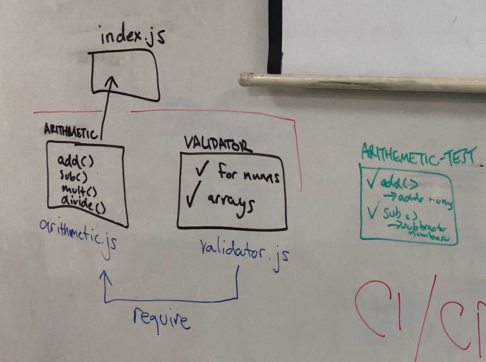

LAB - Class 01

Project Name : Tests for validation

Author: Mohammed Alhawamdeh

Links and Resources
submission PR = https://github.com/Mohammed-401-advanced-javascript/Lab-01/pull/1

ci/cd (GitHub Actions) = https://github.com/Mohammed-401-advanced-javascript/Lab-01/actions

back-end server url (when applicable)
front-end application (when applicable)
Setup
.env requirements (where applicable)
i.e.

PORT - Port Number
MONGODB_URI - URL to the running mongo instance/db
How to initialize/run your application (where applicable)
e.g. npm start

Tests

How do you run tests?

Any tests of note?

Describe any tests that you did not complete, skipped, etc

UML 

Link to an image of the UML for your application and response to events

